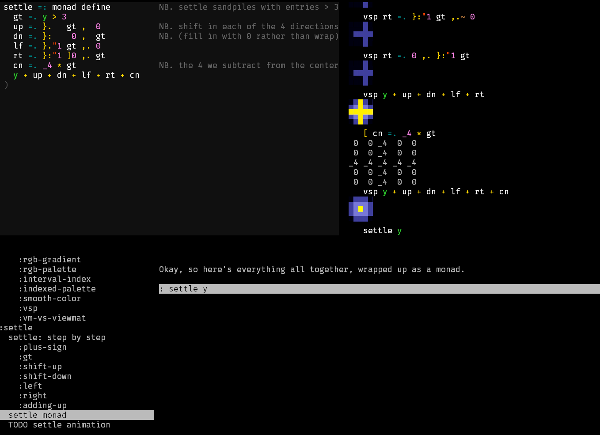

# jprez

This is a tool for making presentations about programming, with an initial focus on <a href="https://jsoftware.com/">J programming language</a>, (in which it is written).

# current status

This software is still in development and not really usable on its own yet.

It is also currently the subject of the **<a href="https://twitch.tv/tangentstorm/schedule/">Ridiculously Early J Morning Show</a>** on twitch, where I spend an hour each morning (8am-9am Eastern Time) livecoding this thing.

(Past episodes are available at https://youtube.com/c/tangentstorm/, along with my scripted programming videos.)

# orientation


There are four sections to the screen above.

- Top left: a code editor, as it will appear in the presentation.
- Top right: a J repl (read-eval-print loop), as it will appear in the presentation.
- Bottom left: an outline of the presentation
- Bottom right: the script ("screenplay") for this section of the presentation.

The screenplay is stored in an <a href="http://orgmode.org/">org-mode</a> formatted file. The one from the screenshot is <a href="https://github.com/tangentstorm/j-talks/blob/master/s1/e3-sandpiles-in-j/sandpiles-j.org">sandpiles-j.org</a>, and is the script for the upcoming code review / code golf followup to my <a href="https://www.youtube.com/watch?v=hBdJB-BzudU">sandpiles video</a>.

# requirements

( Do not expect to be able to run this without changing some hard-coded paths right now. )

J version 9.02 (or greater) from http://jsoftware.com/

Run the following code from J to install the two required libraries:

```
install'github:tangentstorm/j-lex@main'
install'github:tangentstorm/j-kvm@work'  NB. dev branch. not main!!
```

Code for the dependencies are at:

  * http://github.com/tangentstorm/j-lex/
  * https://github.com/tangentstorm/j-kvm/tree/work
